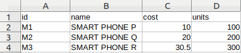

# SpreadsheetToFiles
Generate Text Files using a Spreadsheet and Templates for rendering.

It uses ODS as format for Spreadsheet, and Apache Freemaker as template system.

```
usage: java -jar SpreadsheetToFiles.jar <input ods file> -t <templates directory> -o <output directory> [ -d ]
 -d                         debug mode on
 -o <output directory>      output directory path
 -t <templates directory>   templates directory path
 -version                   show version
```

#### Templates
For template design check out [here](https://freemarker.apache.org/docs/dgui.html)	


## Examples

**ODs content**



**Template**

```
<?xml version="1.0" encoding="UTF-8"?>
<products>
<#list products as product>
  <product>
    <id>${product.id}</id>
    <units>${product.units?eval}</units>
    <cost>${product.cost}</cost>
    <name>${product.name}</name>
  </product>
</#list>
</products>
```

**Output**

```
<?xml version="1.0" encoding="UTF-8"?>
<products>
  <product>
    <id>M1</id>
    <units>100</units>
    <cost>10.0</cost>
    <name>SMART PHONE P</name>
  </product>
  <product>
    <id>M2</id>
    <units>200</units>
    <cost>20.0</cost>
    <name>SMART PHONE Q</name>
  </product>
  <product>
    <id>M3</id>
    <units>300</units>
    <cost>30.5</cost>
    <name>SMART PHONE R</name>
  </product>
</products>
```

**Execution:**
```
  java -jar tests.ods -t ./stage/templates/ -o ./stage/outputs/
```

## Development
To test:

```
mvn test
```

To generate executable jar:

```
mvn package
```

## Libraries
- [Apache commons](http://commons.apache.org/), for license see [here](http://www.apache.org/licenses/)
- [Apache Freemaker](https://freemarker.apache.org/), for licence see [here](https://freemarker.apache.org/docs/app_license.html)
- [SODS](https://github.com/miachm/SODS), for licence see [here](https://github.com/miachm/SODS/blob/master/LICENSE)
